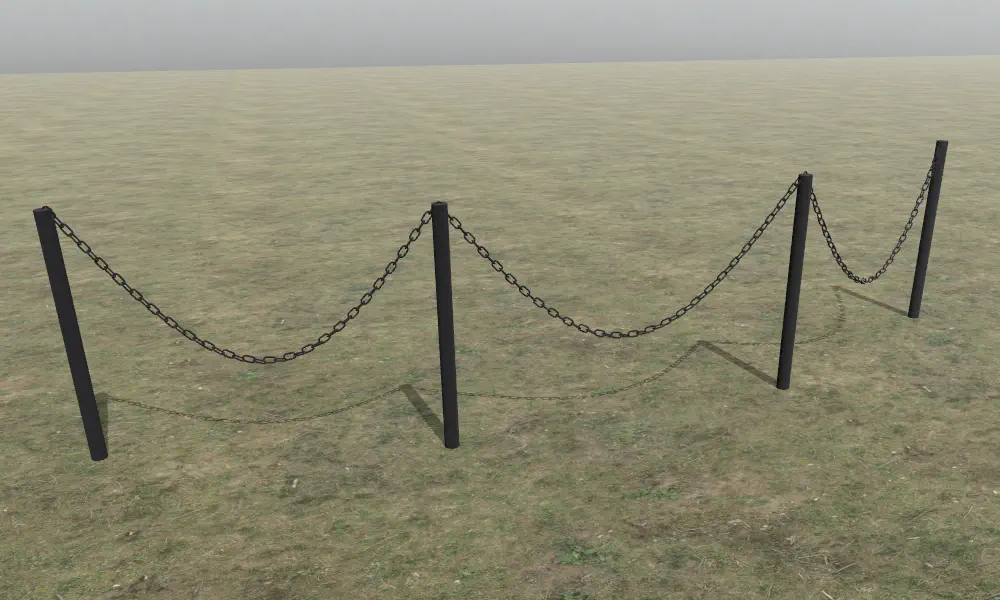
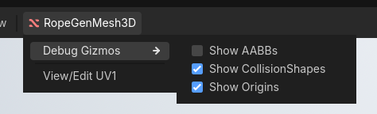

# RopeGenMesh3D

Allows for the creation of procedural rope and rope-like geometry with collisions and LODs.  
Important: this addon **WILL NOT** simulate dynamic ropes; its purpose is only to procedurally generate geometry.




This addon consists of a single node that serves as a container. The `RenderingServer` is used to spawn geometry outside of the `SceneTree`. The geometry is created using `ImporterMesh`, with three additional levels of detail generated by skipping indices. Collisions can also be generated in a similar way using `PhysicsServer3D`.

The generated mesh will have its vertices colored as follows:
- **R channel**: Specifies how close a vertex is to the "hook" (index point). 0.0 marks elements placed directly at hook (i.e. excluded from animation), while values greater than 0.0 are applied in the middle. Always in range 0.0 to 1.0.
- **G channel**: Offset parameter for breaking animation uniformity or to identify segments by unique value in the shader. Calculated as `current_segment / all_segments` and always in range 0.0 to 1.0.
- **B channel**: Currently not used. *(Planned as being copied directly from `mse_mesh` vertex color B channel for further artistic control.)*
- **A channel**: Currently not used.

There is a simple wind .gdshader file in the `shaders` directory that demonstrates how to use the vertex colors.

The node also includes a simple visual UV editor that allows for better placement of the generated mesh on a texture or trim sheet.


There are also custom debug shapes that allows for toggling container origins, AABBs and CollisionShapes visibility.



---

## RopeData Resource

The `RopeGenMesh3D` node uses a `RopeData` resource to configure the rope generation. Create a new `RopeData` resource and assign it to the node to begin customizing your rope.

### Core Properties

#### `points: PackedVector3Array`
Defines the path of the rope. Each point represents a position in 3D space, and individual mesh segments will be generated between consecutive points. At minimum, two points are needed to create a rope.

#### `material: Material`
The material applied to all generated meshes.

#### `visibility_layers: int` (default: 1)
The render layer(s) that the rope instances will be drawn on. Controls which cameras can see the rope.

#### `single_mesh: bool` (default: true)
When enabled, creates a single combined mesh for the entire rope. When disabled, creates separate meshes between each pair of points, allowing for individual frustum culling.

**Use single_mesh = true:** When the rope fits within the camera frustum and you want better performance.  
**Use single_mesh = false:** For very long ropes where parts may be off-screen.

---

### Mesh Generation

#### `mesh_type: MeshType` (default: EXTRUDED_CYLINDER)
Determines how the rope geometry is generated.

**Available types:**
- **EXTRUDED_CYLINDER (0):** Generates a cylindrical mesh extruded along the rope path. Best for cables, wires, and traditional rope appearance.
- **MESH_SEGMENT_ARRAY (1):** Repeats a custom mesh along the rope path. Best for chains, decorative elements, or specialized rope designs.


### Extruded Cylinder Settings
*Only visible when `mesh_type = EXTRUDED_CYLINDER`*

#### `ext_radius: float` (default: 0.5)
The radius of the extruded cylinder. Controls the thickness of the rope.

#### `ext_u_segments: int` (default: 16)
Number of edges around the cylinder's circumference. Higher values create a smoother, more circular cross-section but increase vertex count.

**Guidelines:**
- 8-12: Low poly ropes
- 16-24: Standard quality
- 32+: High quality smooth cables (rarely needed)

#### `ext_v_segments: int` (default: 8)
Number of rings along each segment of the cylinder mesh. Higher values create smoother curves but increase vertex count.

#### Texture Mapping
Fine-tunes how textures are applied to the generated mesh:

- **`tex_uv_translation: Vector2`** (default: Vector2.ZERO)  
  Shifts the texture coordinates in UV space.

- **`tex_uv_rotation_origin: Vector2`** (default: Vector2(0.5, 0.5))  
  The pivot point for UV rotation. (0.5, 0.5) rotates around the center, (0, 0) around the top-left corner.

- **`tex_uv_rotation_angle_degrees: float`** (default: 0.0)  
  Rotates the texture coordinates clockwise by the specified angle in degrees.

- **`tex_uv_scale: Vector2`** (default: Vector2.ONE)  
  Scales the texture coordinates. Values greater than 1.0 to tile the texture, less than 1.0 stretch it.

---

### Mesh Segment Array Settings
*Only visible when `mesh_type = MESH_SEGMENT_ARRAY`*

#### `mse_mesh: ArrayMesh`
The mesh that will be repeated along the rope path. Allows to create chains, links, or any custom repeating geometry.

#### `mse_forward_axis: Vector3` (default: Vector3.RIGHT)
Defines which direction the mesh "points" or faces forward along the rope path. This is necessary when the mesh's origin is not centered.

**Common values:**
- Vector3.RIGHT (1, 0, 0) - Mesh points along +X axis
- Vector3.FORWARD (0, 0, 1) - Mesh points along +Z axis
- Vector3.UP (0, 1, 0) - Mesh points along +Y axis

Negative axes should work as well.

#### `mse_instance_spacing: float` (default: 1.0)
Multiplier for the spacing between repeated mesh instances. Values less than 1.0 create tighter spacing, greater than 1.0 create looser spacing.

#### `mse_rotation_degrees: Vector3` (default: Vector3.ZERO)
Rotation applied to each mesh instance in their local space. Allows for further fine-tuning of repeated elements.

---

### Sag Effect

#### `sag_offset: Vector3` (default: Vector3(0.0, -0.1, 0.0))
Controls how much the rope sags between points, simulating the natural droop of a suspended cable. The offset is applied to intermediate vertices between the points.

#### `sag_keep_local_space: bool` (default: false)
When enabled, the sag offset is applied in the node's local coordinate system rather than world space. Useful when the rope container rotates or moves, but the sag should always point in global space direction.

---

### Level of Detail (LOD)

LOD settings automatically reduce mesh complexity at distance to improve performance.

#### `lod_bias: float` (default: 0.02)
Controls how quickly the mesh transitions to lower LOD versions. Lower values = faster transitions.

**Guidelines:**
- 0.01-0.05: For very thin geometry (radius < 0.25)
- 0.05-0.1: Standard ropes
- 0.1+: Thicker cables where detail is more visible

#### `lod_level1_distance: float` (default: 2.0)
Distance at which the first LOD level appears.

#### `lod_level2_distance: float` (default: 10.0)
Distance at which the second LOD level appears.

#### `lod_level3_distance: float` (default: 40.0)
Distance at which the third (lowest detail) LOD level appears.

---

### Collision Settings

#### `use_collisions: bool` (default: false)
Enables physics collision generation. When enabled, a `StaticBody3D` is created for each mesh segment (or a single body if `single_mesh` is true).

#### `col_shape_type: ColShapeType` (default: TRIMESH)
*Only visible when `use_collisions = true`*

The type of collision shape to generate:
- **TRIMESH (0):** Triangle mesh collision. Most accurate but more expensive.
- **SINGLE_CONVEX (1):** Simple convex hull. Faster than trimesh but less accurate.
- **SIMPLIFIED_CONVEX (2):** Simplified convex hull. Fastest option, least accurate.

**WARNING!** Right now prefer trimesh `ColShapeType.TRIMESH` when `mesh_type` is set to `ColShapeType.EXTRUDED_CYLINDER`, other types will introduce collision errors.

#### `col_collision_layer: int` (default: 0)
*Only visible when `use_collisions = true`*

The physics layer(s) this collision object is in.

#### `col_collision_mask: int` (default: 0)
*Only visible when `use_collisions = true`*

The physics layer(s) this collision object scans for collisions.


## RopeGenMesh3D Public API

### Signals

**`generation_finished`**  
Emitted when mesh generation is complete.

### Methods

**`func has_generated_mesh() -> bool`**  
Returns `true` if there are active RIDs for meshes registered in the `RenderingServer` and valid `RopeData` present.

**`func calculate_global_point_at(rope_point_idx: int, factor: float) -> Vector3`**  
Calculates a 3D point in global coordinates at the given index point of `rope_data`, interpolated toward the next index by `factor`. The resulting point is affected by the sag factor.

Use this method when you want to spawn objects "on" the rope.

**Parameters:**
- `rope_point_idx`: The index of the starting point (0-based)
- `factor`: Interpolation factor between the current point and the next (0.0 to 1.0)

**Example:**
```gdscript
# Spawn a light at 30% between points 1 and 2
var spawn_pos = rope_node.calculate_global_point_at(1, 0.3)
var light = OmniLight3D.new()
add_child(light)
light.global_position = spawn_pos
```